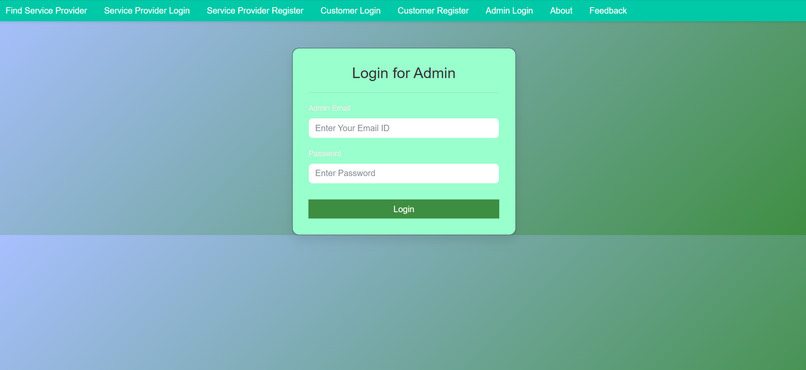
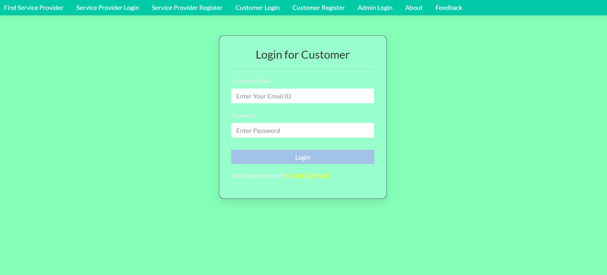
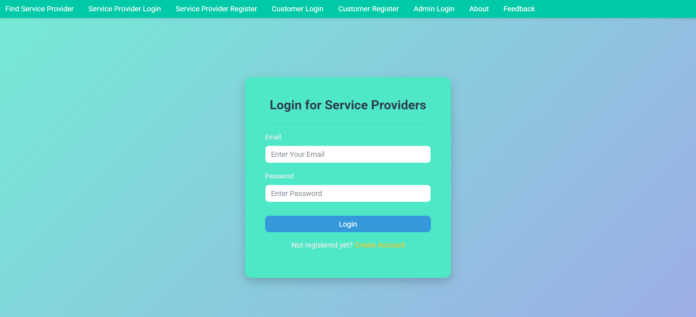
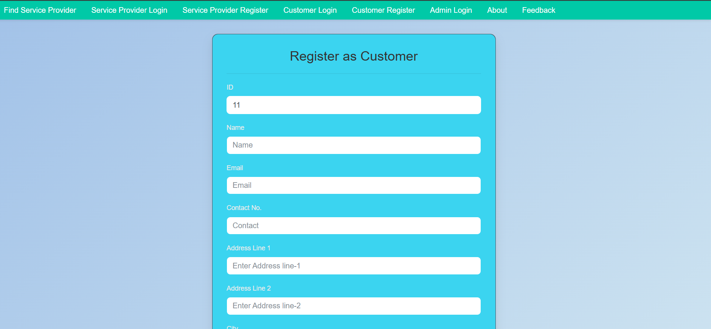
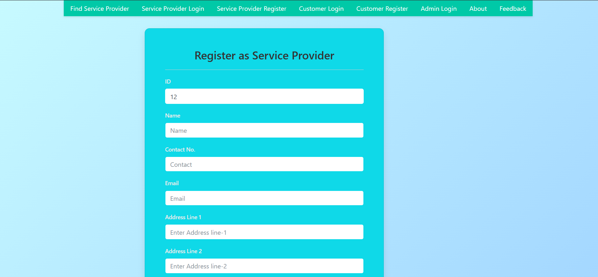
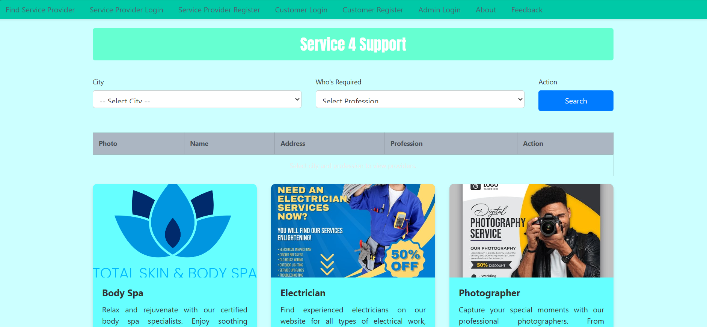
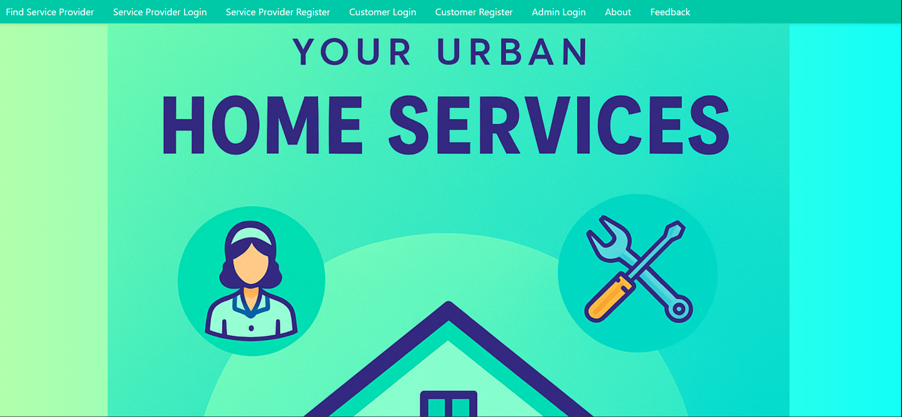
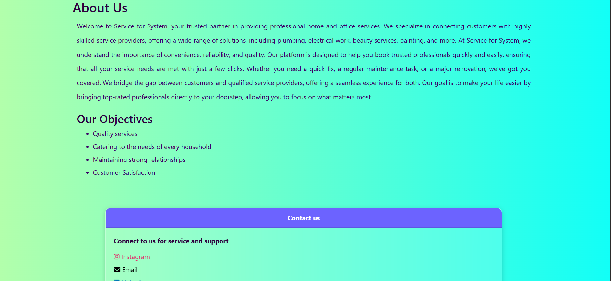
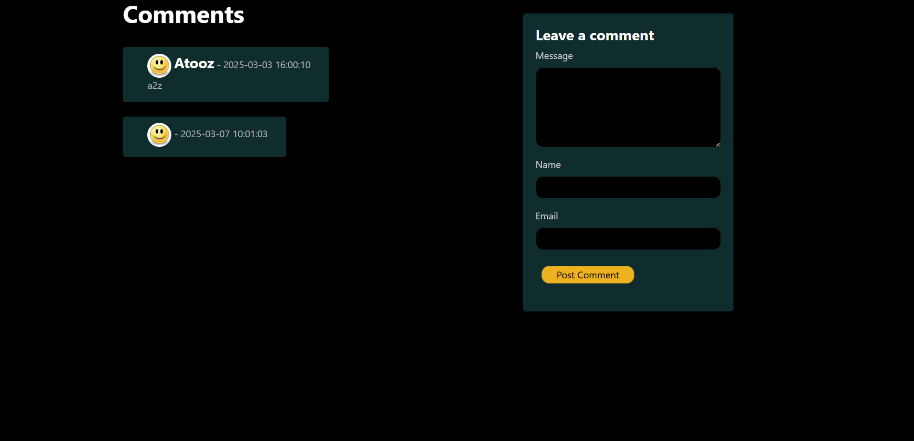

#  🌆 Urban Services Management System

The *Urban Services Management System* is a web-based platform developed using Java Servlets and JSP to simplify access to essential services like plumbing, electrical work, and household maintenance in urban areas. The application allows service providers to register and offer their services, while users can browse, request, and book those services directly through the system. It ensures streamlined interactions with role-specific logins for administrators, service providers, and end-users, each having access to tailored functionalities based on their roles.

The admin panel facilitates service provider approvals, request monitoring, and general system oversight, while service providers can manage bookings and update their availability. On the client side, users enjoy a simple interface to request services and view status updates. Built with HTML, CSS, and Bootstrap for responsiveness and JDBC for database operations, the application is deployable on Apache Tomcat 9,10 and is ideal for cities seeking to organize and digitize urban service delivery.

This system not only enhances convenience for residents but also creates a structured workflow for service providers, ensuring better visibility and scheduling. The modular architecture of the project allows for easy maintenance and future upgrades, such as integrating user feedback, GPS-based service tracking, and real-time booking notifications. With a clear separation of concerns and scalable design, the Urban Services Management System provides a solid foundation for smart city service management.

---

## 🚀 Features

- 🧑 User and Service Provider Registration  
- 🔐 Admin and Provider Login System  
- 📅 Booking and Request Handling  
- 📬 Service Acceptance and Rejection  
- 🏠 Role-Based JSP Interfaces  
- 📊 Admin Dashboard for Service Oversight  

---

## 🛠 Technologies Used

- *Java (Servlets, JSP)*
- *JDBC* – Java Database Connectivity
- *MySQL* – Backend Database
- *Apache Tomcat 10.1 & 9 – Deployment Server
- *HTML, CSS, Bootstrap* – Frontend Design
- *Eclipse IDE* – Development Environment

---

## 📸 Screenshots
### 🔐 Authentication Pages

- **Admin Login**  
  

- **Customer Login**  
  

- **Service Provider Login**  
  

- **Register as Customer**  
  

- **Register as Service Provider**  
  

---

### 🌐 Website Pages

- **Home Page**  
  

- **About Us Page**  
  

- **About Us (Alternate View)**  
  

- **Feedback Page**  
  

---

## 🚀 Future Enhancements

- Add customer feedback and ratings  
- Enable real-time notifications for bookings  
- Integrate map/location tracking for providers  
- Implement password recovery and security upgrades  
- Add user and provider profile dashboards  

---
